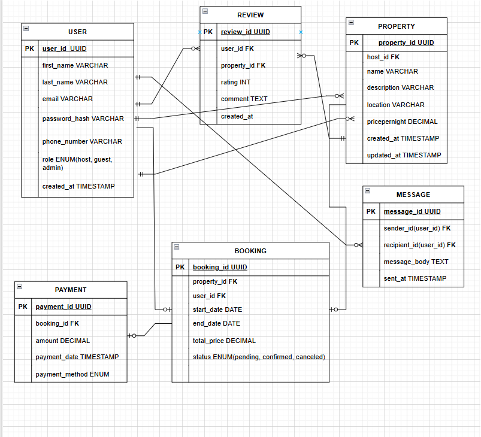

# Database Design and Normalization Analysis for AirBnB

This document provides an analysis of the database design for an AirBnB-like application. It reviews two diagrams: a conceptual Entity-Relationship (ER) Diagram and a more detailed Relational Schema. It also includes a formal analysis to confirm that the database schema adheres to the Third Normal Form (3NF).

## Database Specification Overview

The design is based on the following entities and their attributes:

Click to view Full Database Specification

- **User**: Stores user information, including roles like guest, host, or admin.
- **Property**: Contains details about the rental properties, linked to a host (User).
- **Booking**: An associative entity linking a `User` and a `Property` for a specific duration.
- **Payment**: Records payment details for a specific `Booking`.
- **Review**: An associative entity allowing a `User` to post a rating and comment for a `Property`.
- **Message**: Stores messages sent between `Users`.

---

## 1. Conceptual Entity-Relationship (ER) Diagram Analysis

This diagram uses Chen notation to represent a high-level, conceptual view of the database.

### Interpretation

- **Entities**: The diagram correctly identifies the core entities: `USER`, `PROPERTY`, `REVIEW`, `BOOKING`, `PAYMENT`, and `MESSAGE`. These are represented by rectangles.
- **Relationships**: Relationships are shown using diamonds (e.g., `REVIEWS`, `BOOKS`). This model attempts to show how entities interact:
  - A `USER` makes a `BOOKING` for a `PROPERTY`.
  - A `USER` writes a `REVIEW` for a `PROPERTY`.
  - A `BOOKING` leads to a `PAYMENT`.
  - `USERS` can send and receive `MESSAGES`.

### Critique and Areas for Improvement

While a good conceptual start, this diagram has some common modeling inaccuracies:

1.  **Redundant Relationships**: The `BOOKING` and `REVIEW` entities are **associative entities** (or "junction tables"). They exist specifically to connect other entities. In modern ERDs, you connect the participating entities directly to the associative entity, making the relationship diamonds (`BOOKS`, `REVIEWED`) redundant. For example, the line should go from `USER` directly to `BOOKING`, not through a `BOOKS` diamond.
2.  **Missing "Hosts" Relationship**: A critical relationship specified is that a `USER` (as a host) owns a `PROPERTY`. This one-to-many relationship (one user can host many properties) is missing from this diagram.

---

## 2. Relational Schema Diagram Analysis

This diagram is a **Relational Schema**, which is a more detailed and physically accurate representation of the database tables. It uses Crow's Foot notation and is an excellent model for implementation.

### Interpretation

This diagram accurately translates the database specification into a set of tables, columns, and relationships.

- **Tables and Attributes**: Each table (`USER`, `PROPERTY`, etc.) correctly lists its attributes (columns) as per the specification.
- **Primary Keys (PK)**: Each table has a clearly marked Primary Key (e.g., `user_id_UUID`).
- **Foreign Keys (FK)**: The diagram correctly establishes relationships using Foreign Keys.

### Key Relationships Shown

This schema correctly models all the required relationships:

- **User -> Property (Hosting)**: A one-to-many relationship where one `USER` can be the host of many `PROPERTIES`. This corrects the omission from the first diagram.
- **User/Property -> Booking**: A `BOOKING` is correctly linked to exactly one `USER` and one `PROPERTY`.
- **Booking -> Payment**: A one-to-one relationship is shown, where a `PAYMENT` must belong to one `BOOKING`, and a `BOOKING` can have zero or one `PAYMENTS`. This correctly models that a payment is made for a booking.
- **User/Property -> Review**: A `REVIEW` is correctly linked to the `USER` who wrote it and the `PROPERTY` it is about.
- **User -> Message (Sending/Receiving)**: The schema cleverly uses two separate relationships from `USER` to `MESSAGE` to represent the `sender_id` and `recipient_id`, correctly modeling the messaging functionality.

This relational schema is a precise and implementation-ready design that fully adheres to the project specifications.
