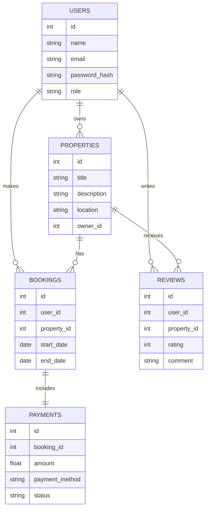

# Overview of the AirBnB Clone
------
## 🚀 Objective

The backend for the Airbnb Clone project is designed to provide a robust and scalable foundation for managing user interactions, property listings, bookings, and payments. This backend will support various functionalities required to mimic the core features of Airbnb, ensuring a smooth experience for users and hosts.

## 🏆 Project Goals
- **User Management**: Implement a secure system for user registration, authentication, and profile management.

- **Property Management**: Develop features for property listing creation, updates, and retrieval.

- **Booking System**: Create a booking mechanism for users to reserve properties and manage booking details.

- **Payment Processing**: Integrate a payment system to handle transactions and record payment details.

- **Review System**: Allow users to leave reviews and ratings for properties.
- **Data Optimization**: Ensure efficient data retrieval and storage through database optimizations.

## ⚙️ Technology Stack
- **Django**: A high-level Python web framework used for building the RESTful API.
- **Django REST Framework**: Provides tools for creating and managing RESTful APIs.
- **PostgreSQL**: A powerful relational database used for data storage.
- **GraphQL**: Allows for flexible and efficient querying of data.
- **Celery**: For handling asynchronous tasks such as sending notifications or processing payments.
- **Redis**: Used for caching and session management.
- **Docker**: Containerization tool for consistent development and deployment environments.
- **CI/CD Pipelines**: Automated pipelines for testing and deploying code changes.

## 👥 Team Roles
- **Backend Developer**: Responsible for implementing API endpoints, database schemas, and business logic.
- **Database Administrator**: Manages database design, indexing, and optimizations.
- **DevOps Engineer**: Handles deployment, monitoring, and scaling of the backend services.
- **QA Engineer**: Ensures the backend functionalities are thoroughly tested and meet quality standards.

# 🛠️ Features Overview

## 1. API Documentation
- **OpenAPI Standard**: The backend APIs are documented using the OpenAPI standard to ensure clarity and ease of integration.
- **Django REST Framework**: Provides a comprehensive RESTful API for handling CRUD operations on user and property data.
- **GraphQL**: Offers a flexible and efficient query mechanism for interacting with the backend.

## 2. User Authentication
- **Endpoints**: `/users/`, `/users/{user_id}/`
- **Features**: Register new users, authenticate, and manage user profiles.

## 3. Property Management
- **Endpoints**: `/properties/`, `/properties/{property_id}/`
- **Features**: Create, update, retrieve, and delete property listings.

## 4. Booking System
- **Endpoints**: `/bookings/`, `/bookings/{booking_id}/`
- **Features**: Make, update, and manage bookings, including check-in and check-out details.

## 5. Payment Processing
- **Endpoints**: `/payments/`
- **Features**: Handle payment transactions related to bookings.

## 6. Review System
- **Endpoints**: `/reviews/`, `/reviews/{review_id}/`
- **Features**: Post and manage reviews for properties.

## 7. Database Optimizations
- **Indexing**: Implement indexes for fast retrieval of frequently accessed data.
- **Caching**: Use caching strategies to reduce database load and improve performance.

## 🔑 Key Entities and Fields
### 1. Users
Represents people using the platform, either as guests or property owners.

##### Important Fields:

- id: Unique identifier

- name: Full name

- email: Email address

- password_hash: Encrypted password

- role: "host" or "guest"

##### Relationships:

- A user can list multiple properties (if host).

- A user can make multiple bookings (if guest).

- A user can write multiple reviews.

### 2. Properties
Represents the listings available for booking.

##### Important Fields:

- id: Unique identifier

- title: Property name or title

- description: Detailed description

- location: Address or general location

- owner_id: FK referencing Users.id (host)

##### Relationships:

- A property belongs to one user (owner).

- A property can have many bookings.

- A property can have many reviews.

### 3. Bookings
Represents reservations made by users for properties.

##### Important Fields:

- id: Unique identifier

- user_id: FK referencing Users.id (guest)

- property_id: FK referencing Properties.id

- start_date: Booking start date

- end_date: Booking end date

##### Relationships:

- A booking is made by one user.

- A booking is for one property.

- A booking can have one payment.

### 4. Payments
Represents payments made for bookings.

##### Important Fields:

- id: Unique identifier

- booking_id: FK referencing Bookings.id

- amount: Total amount paid

- payment_method: e.g., card, PayPal

- status: e.g., pending, completed, failed

##### Relationships:

- A payment is tied to one booking.

### 5. Reviews
Represents user feedback on properties.

##### Important Fields:

- id: Unique identifier

- user_id: FK referencing Users.id

- property_id: FK referencing Properties.id

- rating: Integer (e.g., 1–5)

- comment: Text review

##### Relationships:

- A review is written by one user.

- A review is for one property.

## API Security

### Key Security Measures

### 1. Authentication
- **Purpose**: Ensure that users are who they claim to be.
- **Implementation**: 
  - Use secure user login with hashed passwords (e.g., bcrypt).
  - Support token-based authentication (e.g., JWT or OAuth2).
  - Enforce HTTPS for all API communication.

### 2. Authorization
- **Purpose**: Control what authenticated users can access or modify.
- **Implementation**:
  - Role-based access control (e.g., host vs. guest).
  - Verify user identity before allowing updates or deletions (e.g., only a property owner can edit their listing).
  - Limit actions like review posting or booking editing to valid users.

### 3. Rate Limiting
- **Purpose**: Prevent abuse and protect against brute-force attacks.
- **Implementation**:
  - Limit number of login attempts per user/IP.
  - Throttle requests to sensitive endpoints like `/payments/` or `/users/login/`.

### 4. Input Validation & Sanitization
- **Purpose**: Prevent injection attacks (SQL, XSS).
- **Implementation**:
  - Sanitize and validate all input fields across endpoints like `/reviews/`, `/properties/`, etc.
  - Enforce strict schema validation using serializers or input schemas.

### 5. Data Encryption
- **Purpose**: Protect sensitive data at rest and in transit.
- **Implementation**:
  - Encrypt passwords and sensitive fields in the database.
  - Use TLS (HTTPS) for secure communication.

---

## Why Security Is Crucial for Each Area

### 👤 Users
- **Reason**: User accounts contain personal details and access tokens.
- **Risks**: Identity theft, account takeover.
- **Security**: Strong password hashing, authentication, and authorization required.

### 🏠 Properties
- **Reason**: Users (hosts) manage their listings and pricing.
- **Risks**: Unauthorized edits or deletions can harm host reputation or result in loss of business.
- **Security**: Role-based access control ensures only the owner can modify their properties.

### 📅 Bookings
- **Reason**: Booking data includes personal schedules and travel plans.
- **Risks**: Unauthorized access can lead to privacy violations or fraud.
- **Security**: Only the user who made the booking should access or modify it.

### 💳 Payments
- **Reason**: Involves financial transactions and sensitive data.
- **Risks**: Payment fraud, data theft, chargebacks.
- **Security**: Secure payment gateways, HTTPS, and tokenized transactions.

### ✍️ Reviews
- **Reason**: Users rely on authentic reviews for trust and safety.
- **Risks**: Fake or malicious reviews can damage property reputation.
- **Security**: Only verified users who completed bookings should be allowed to post reviews.

### 📊 Database (Backend)
- **Reason**: Core system integrity and data performance.
- **Risks**: Data breaches, performance issues under attack.
- **Security**: Indexing and caching improve performance; firewalls and access restrictions protect integrity.

##  CI/CD Pipeline Overview

CI/CD pipelines are automated workflows used in software development to streamline and accelerate the process of building, testing, and deploying code.

### 🚀 What is CI/CD?
CI = Continuous Integration

CD = Continuous Delivery (or Continuous Deployment)

Together, CI/CD helps development teams deliver code changes more frequently and reliably.

## ⚙️ Importance of CI/CD for This Project

### 1. ✅ Ensures Code Quality and Reliability
- **Why it matters**: The platform handles sensitive operations—like booking properties and processing payments—so every change must be tested.
- **CI Impact**: Automated tests run on every code push to catch bugs before they reach production.

### 2. 🚀 Speeds Up Development and Deployment
- **Why it matters**: Frequent updates (e.g., adding new features like review sorting or better property filtering) are easier to manage.
- **CD Impact**: Automatically deploy tested code to staging or production, reducing manual work and human error.

### 3. 🛡️ Protects Critical User Flows
- **Why it matters**: Booking, payments, and user data must be secure and function reliably at all times.
- **CI/CD Impact**: Fails builds or blocks deployments if tests (like payment logic or authentication) fail.

### 4. 🧪 Enables Safe Experimentation
- **Why it matters**: You may want to A/B test a new property detail layout or booking experience.
- **CI/CD Impact**: Feature branches can be automatically tested and deployed to staging environments for QA and testing.

### 5. 📦 Simplifies Rollbacks and Version Control
- **Why it matters**: If a release causes issues (e.g., bookings not saving), you need a fast recovery.
- **CD Impact**: Easily roll back to the last known stable build with versioned deployments.

### 6. 👥 Improves Collaboration
- **Why it matters**: Teams can work on features like "User Reviews" and "Property Management" in parallel.
- **CI Impact**: Merge requests are automatically tested, reducing integration issues and bottlenecks.

### 7. 📊 Maintains Uptime and Trust
- **Why it matters**: Users expect consistent access—especially for bookings and payments.
- **CI/CD Impact**: Catch errors early, ensure quality, and push updates without downtime.

---

## 🧰 Example CI/CD Tools You Could Use
- **GitHub Actions**: Native integration with GitHub, good for open-source and private projects.
- **GitLab CI/CD**: Great if you're using GitLab repositories.
- **Docker + Jenkins**: Customizable pipelines for more control.

---

> 🔐 **In a platform involving financial transactions, personal data, and real-time reservations, CI/CD is not a luxury—it's a necessity.** It ensures that every change is reliable, fast, and secure.
